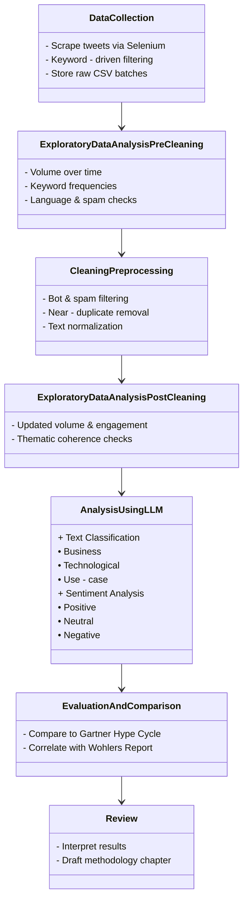
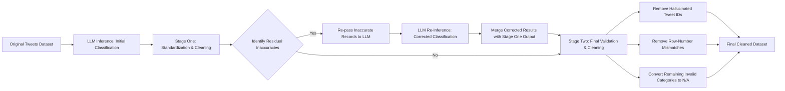

```mermaid
classDiagram
    %% Flow relationships
    DataCollection --> Exploratory Data Analysis (Pre-cleaning)
    Exploratory Data Analysis (Pre-cleaning) --> CleaningPreprocessing
    CleaningPreprocessing --> Exploratory Data Analysis (Post-cleaning)
    Exploratory Data Analysis (Post-cleaning) --> Analysis Using LLM
    Analysis Using LLM --> Evaluation and Comparison
    Evaluation and Comparison --> Review

    %% Stage definitions
    class DataCollection {
      - Scrape tweets via Selenium  
      - Keyword‐driven filtering  
      - Store raw CSV batches  
    }

    class Exploratory Data Analysis (Pre-cleaning) {
      - Volume over time  
      - Keyword frequencies  
      - Language & spam checks  
    }

    class CleaningPreprocessing {
      - Bot & spam filtering  
      - Near‐duplicate removal  
      - Text normalization  
    }

    class Exploratory Data Analysis (Post-cleaning) {
      - Updated volume & engagement  
      - Thematic coherence checks  
    }

    class Analysis Using LLM {
      + Text Classification  
        • Business  
        • Technological  
        • Use‐case  
      + Sentiment Analysis  
        • Positive  
        • Neutral  
        • Negative  
    }

    class Evaluation and Comparison {
      - Compare to Gartner Hype Cycle  
      - Correlate with Wohlers Report  
    }

    class Review {
      - Interpret results  
      - Draft methodology chapter  
    }

```





# Post LLM Review and Cleaning
